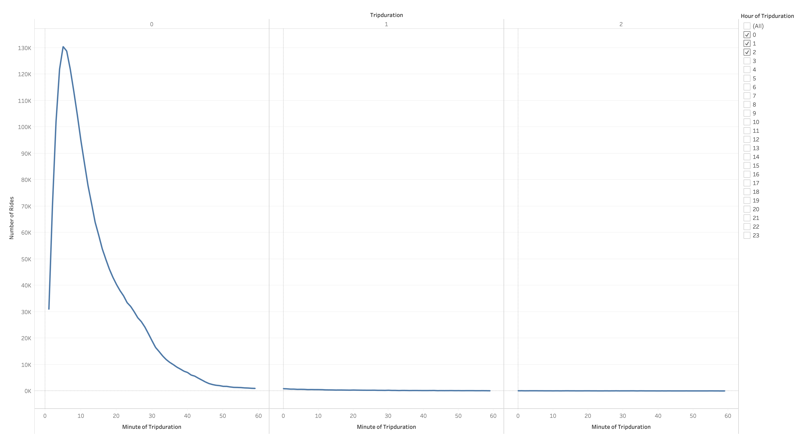
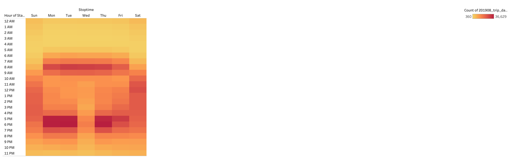
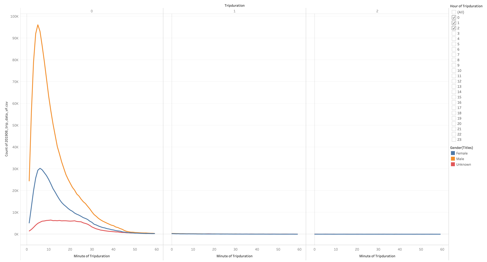
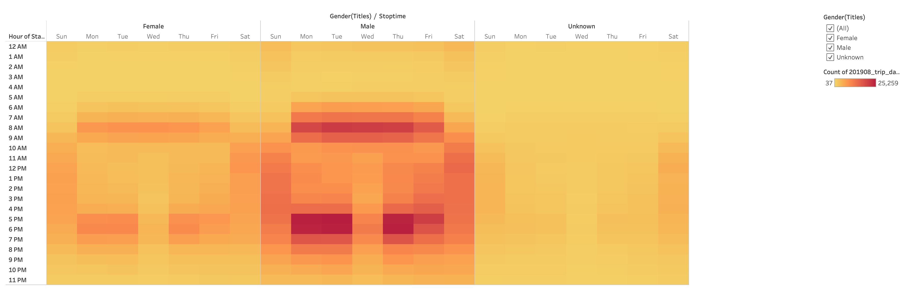
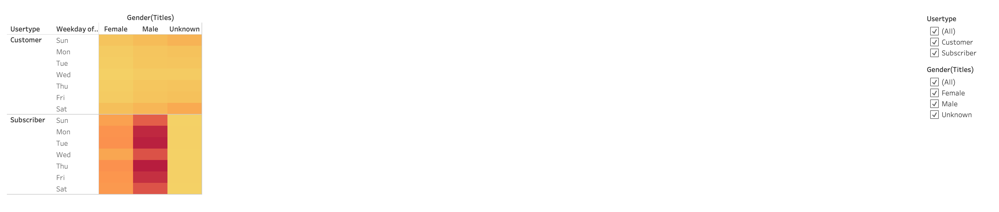
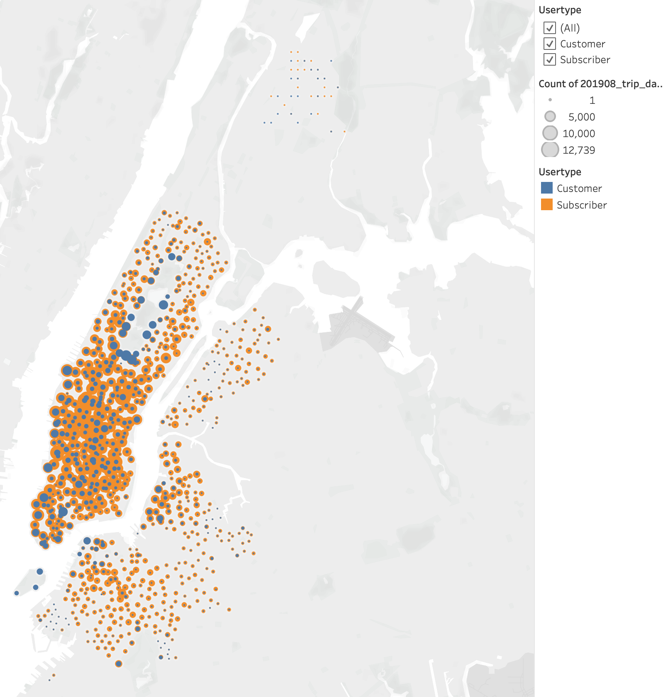
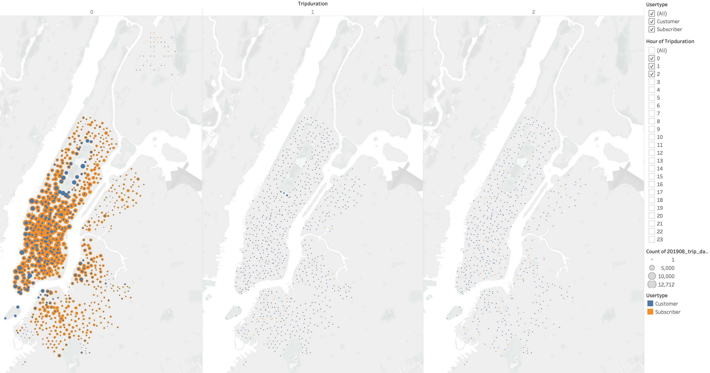
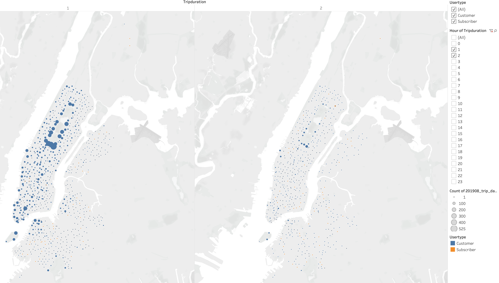
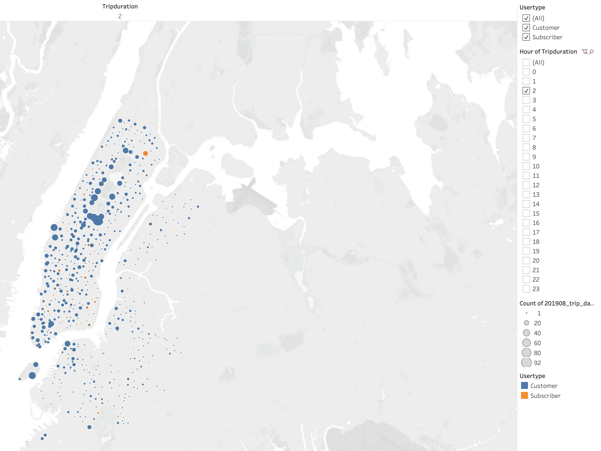

# bikesharing
Author: Jerome Simmons

[link to dashboard] (https://public.tableau.com/shared/Y9KD5C9NS?:display_count=y&:origin=viz_share_link)

## Overview of the Analysis
I have analyzed (August, 2019) data that provides insights on customer & product usage data from a bike sharing program in New York City. I have produced several visualizations using tableau in order to provide insights that might be applied to a bike sharing start up concept in Des Moines, IA.

## Results
Through my analysis of the data set, I've developed 7 insights.

#### 1. Almost all bile rides are under an hour. The majority of these rides last less than 30 minutes.

#### 2. The majority of users exhibit commuter behavior using ride bikes during rush hour periods (M - F, 8a & 5p - 6p).

#### 3. Although males comprise the majority of our riders, males and female trip durations have the same usage pattern. Unknown users have a different trip duration pattern, which suggests a different customer type and use case.

#### 4. Male & Female users both tend use our products during the rush hour periods. Unknown gender users have a more uniform distribution, but a propensity to use our products on weekends.

#### 5. Users with gender data tend to be subscribers who use our products for commuting purposes. Whereas unknown gendered users tend to be 1 time customers who use product for leisure weekend activities.

#### 6. Customers and Subscribers gravitate to different starting points.

#### 7. Customers tend to go for longer rides than subscribers. Many of these Customers tend to start in central park.

## Summary
Based on these insights, we know that we have two main customer types (1) subscribers who use bikes to commute and (2) customers who use bikes for leisure activities. With this information, we understand the New York City market, but we still need to evaluate whether or not Des Moines is a good market for a bike sharing program. To understand this, we need visual data sets to answer the following questions

* Does the city have enough demand for leisure activities?
* Does the city have enough demand for subscription services?

We could evaluate and compare the (1) cities geographical layout i.e. parks, street maps, etc., (2) cars per capita and distance from residential to commercial areas, (3) population density, and other factors. By visually comparing the two market areas over these and other criteria, we will have a better understanding of whether or not a bike sharing program would prosper in a smaller market such as Des Moines, IA.
